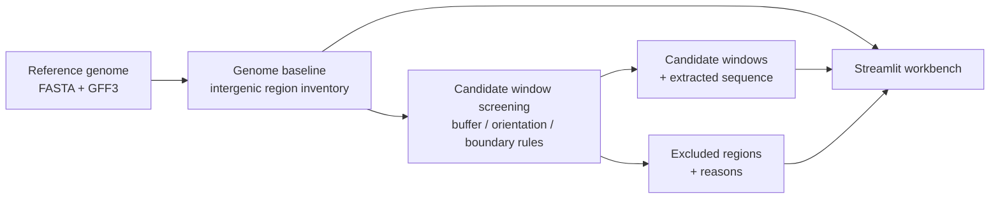
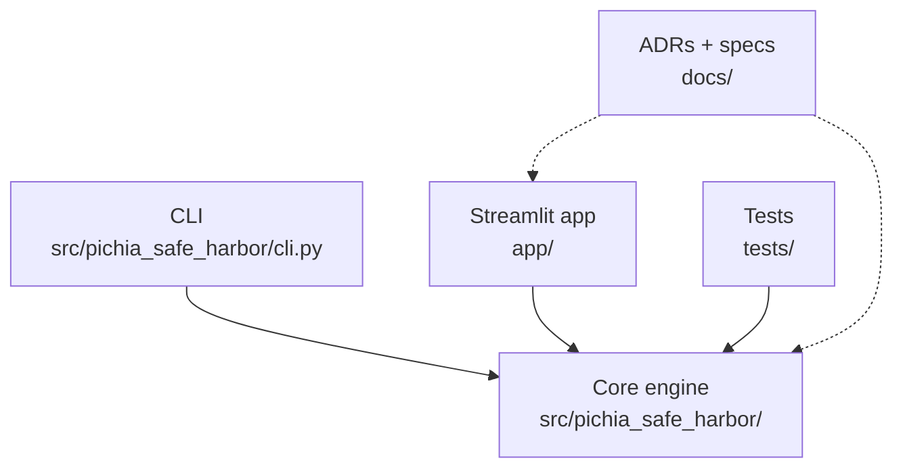

<div align="center">

# PichiaSafeHarbor

**Genomic safe-harbor site discovery framework for *Komagataella phaffii* (Pichia pastoris) strain engineering**

[](https://www.python.org/)
[](https://streamlit.io/)
[](https://pandas.pydata.org/)
[](https://pytest.org/)

**Language:** English | [中文](README.zh-CN.md)

</div>

---

## Overview

PichiaSafeHarbor narrows down candidate genomic integration sites — "safe harbor" loci — for engineering a target *Komagataella phaffii* production strain (referred to throughout this repo as **Strain-T**). Strains under active engineering rarely have their own dedicated, high-quality reference genome, so this project treats that gap as a first-class fact rather than something to paper over: every run is tagged with three independent status fields (execution / verification / **scientific acceptance**), so a structurally-valid computational result is never silently presented as a validated scientific conclusion.

Today the tool performs a rigorous **first-pass structural screen** — intergenic-region enumeration, buffer-distance rules, neighbor-orientation classification, boundary-confidence gating — against a close-strain reference genome (**Strain-B**) used as a coordinate proxy. That narrows tens of thousands of intergenic regions down to a small, inspectable shortlist. A shortlist entry is **not yet** a validated safe-harbor site: essential-gene proximity, repeat/mobile-element overlap, centromere/telomere distance, and strain-specific sequence variation are all still open risk dimensions — and the software says so explicitly in every run's manifest, rather than hiding the gap.

## What It Does

| Area | Current capability |
|---|---|
| Genome baseline | Parse a reference FASTA/GFF3, enumerate every intergenic region genome-wide, classify boundary confidence and neighbor-gene orientation |
| Candidate screening | Buffer-distance + minimum-window rules narrow intergenic regions to structurally valid candidate windows; hard exclusion vs. soft flagging are kept as separate, auditable actions with recorded reasons |
| Sequence extraction | Every candidate window ships with its actual extracted sequence (FASTA + JSON/TSV), verified against the exact reference file used to compute its coordinates |
| Provenance & acceptance | Every run is content-addressed (`run_id`), every artifact hash-verified, and every result carries independent execution / verification / scientific-acceptance status — never collapsed into a single flag |
| Streamlit workbench | Import reference data, trigger runs, and browse candidates / exclusions / genome statistics — the UI delegates to the exact same core library the CLI uses, with zero reimplementation of scientific logic |
| Decision trail | 11 Architecture Decision Records document every major scope call, including two that explicitly paused a promising-looking approach once it turned out to be unvalidated proxy-data compensation rather than durable framework work |

## Workflow



## Architecture



| Layer | Key path | Responsibility |
|---|---|---|
| Core engine | [`src/pichia_safe_harbor/`](src/pichia_safe_harbor/) | Reference validation, FASTA/GFF3 parsing, intergenic-region inventory, candidate-window rule engine, content-addressed run manifests, acceptance-manifest validation. Dependency-free by design. |
| CLI | [`src/pichia_safe_harbor/cli.py`](src/pichia_safe_harbor/cli.py) | Scriptable entry point: fetch/validate reference data, run baseline and candidate-window analyses, create acceptance manifests |
| Streamlit app | [`app/`](app/) | Local workbench: import reference data, trigger core-engine runs, browse results. Never reimplements core scientific logic (see [ADR-0010](docs/adr/ADR-0010-streamlit-import-and-trigger-workflow.md)) |
| Docs | [`docs/`](docs/), [`docs/adr/`](docs/adr/) | Requirements, architecture, execution plan, and the full ADR decision log |
| Tests | [`tests/`](tests/) | 132 tests covering the core engine, CLI, and Streamlit service layer |

## Quick Start

Install the core engine (dependency-free) plus the optional Streamlit extra:

```powershell
python -m venv .venv
.\.venv\Scripts\Activate.ps1
python -m pip install -e ".[app]"
```

Fetch a reference genome bundle and run the pipeline:

```powershell
pichia-safe-harbor fetch strain-b --data-dir reference/data
pichia-safe-harbor baseline --reference strain-b --data-dir reference/data --output-dir local_runs/baseline
pichia-safe-harbor candidate-windows --baseline-run-dir local_runs/baseline --reference strain-b --data-dir reference/data --buffer-distance-bp 150 --min-window-bp 200 --output-dir local_runs/candidates
```

Or launch the Streamlit workbench, which wraps the same two steps with an import/trigger UI:

```powershell
streamlit run app/streamlit_app.py
```

## Engineering Practices

- **Test-driven, 132 passing tests.** Every rule (boundary-confidence gating, buffer-distance shrinkage, interval splitting around exclusion zones, run-id determinism) is exercised against synthetic fixtures before being trusted on real data.
- **Content-addressed provenance.** `run_id` is a hash of the actual input files' checksums, rule parameters, and implementation source — identical inputs always reproduce the identical id; changed inputs always produce a different one.
- **Atomic, hash-verified writes.** Every run writes to a temporary directory and is atomically promoted only on success; every output artifact's size and SHA-256 are recorded in the run manifest and re-verified before any downstream step trusts it.
- **Three-state result model.** `execution_status` (did it run), `verification_status` (did independent recomputation + tests pass), and `scientific_acceptance_status` (is this a validated scientific conclusion) are tracked independently — a run can be fully executed and fully verified while still being correctly labeled `blocked` for scientific acceptance.
- **ADR-gated scope discipline.** 11 ADRs record every major decision, including two ([ADR-0009](docs/adr/ADR-0009-deprioritize-proxy-data-compensation.md), [ADR-0011](docs/adr/ADR-0011-broaden-framework-authorization-exclude-slice2.md)) that explicitly *paused or excluded* a promising-looking analysis route after concluding it was unvalidated proxy-data compensation rather than durable framework work — see [`docs/adr/README.md`](docs/adr/README.md) for the full index.

## Scientific Boundaries

- A "candidate window" is a structural screening result, not a validated safe-harbor site — see Overview above for the specific risk dimensions still unresolved.
- The primary/secondary reference genomes (Strain-B / Strain-C) are close-strain coordinate proxies; `exact_target_strain_coordinates = false` on every run makes this explicit rather than implying strain-specific precision that doesn't exist yet.
- Rule parameters (buffer distance, minimum window length) are illustrative engineering placeholders pending a dedicated threshold-freezing ADR, not scientifically validated defaults.
- Cross-strain collinearity confirmation is explicitly out of scope for now (see ADR-0011) rather than silently skipped.
- sgRNA/CRISPR design, vector/promoter/terminator design, and wet-lab construction are out of scope for this project.

## Data Policy

`reference/data/` (downloaded genome files) and `local_runs/` (run outputs) are gitignored; only the small, versioned manifests and source code are tracked. Fetch reference data locally via `pichia-safe-harbor fetch` before running anything.

## Tests

```powershell
python -m pytest -q
```

## License

This repository does not currently declare an open-source license. Add an explicit license before public reuse, redistribution, or commercial deployment.
