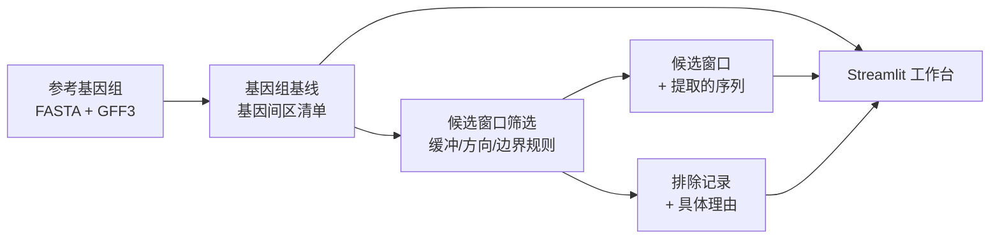
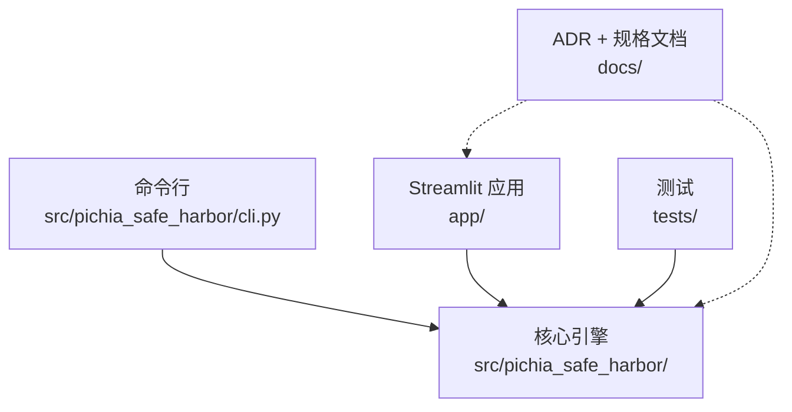

<div align="center">

# PichiaSafeHarbor

**面向毕赤酵母（*Komagataella phaffii* / Pichia pastoris）菌株改造的基因组安全港位点发现框架**

[](https://www.python.org/)
[](https://streamlit.io/)
[](https://pandas.pydata.org/)
[](https://pytest.org/)

**语言：** [英文](README.md) | 中文

</div>

---

## 项目定位

PichiaSafeHarbor 用于为目标毕赤酵母生产菌株（本仓库中统一称为 **Strain-T**）缩小候选基因组整合位点（"安全港"位点）的范围。正在改造中的菌株通常没有自己专属的高质量参考基因组——这个项目把这个缺口当作必须正面处理的事实，而不是绕过去：每次运行都会同时打上三个独立的状态标签（执行状态 / 验证状态 / **科学验收状态**），确保一个"计算上跑通了"的结果，不会被悄悄当成"科学上已验证"的结论展示出来。

目前这套工具做的是严谨的**结构初筛**——基因间区枚举、缓冲距离规则、邻近基因方向分类、边界置信度门禁——参考基因组用的是一个近缘菌株（**Strain-B**）的坐标系统作为代理。这一步能把几万个候选区间缩小到一份可以逐条检查的短名单。但短名单里的一条记录，**还不等于**一个已验证的安全港位点：必需基因邻近风险、重复序列/移动元件重叠、着丝粒/端粒距离、菌株特异性序列差异，这几项风险目前都还没有解决——软件在每次运行的清单里都会如实标注这一点，而不是把它藏起来。

## 功能概览

| 模块 | 当前能力 |
|---|---|
| 基因组基线 | 解析参考基因组 FASTA/GFF3，枚举全基因组范围内的所有基因间区，对边界置信度和邻近基因方向分类 |
| 候选窗口筛选 | 用缓冲距离和最小窗口长度规则，把基因间区收窄成结构上合法的候选窗口；硬排除和软标记是两个独立、可追溯、附带具体理由的动作 |
| 序列提取 | 每个候选窗口都自带实际提取出的序列（FASTA + JSON/TSV），并且会核对这份序列确实来自计算坐标时用的那份参考文件 |
| 溯源与验收 | 每次运行的 `run_id` 都是按内容寻址的，每个产物文件都做哈希校验，每个结果都同时带着独立的执行/验证/科学验收状态——不会合并成一个笼统的标志位 |
| Streamlit 工作台 | 导入参考数据、触发运行、浏览候选/排除记录/基因组统计——界面调用的和命令行完全是同一套核心库，不会在页面里重新实现任何科学逻辑 |
| 决策留痕 | 11 份架构决策记录（ADR）记录了每一次重大范围调整，其中两份明确暂停了一条"看起来有希望"的路线——因为最终发现它是未经验证的代理数据补偿，而不是可长期沉淀的框架代码 |

## 处理流程



## 架构概览



| 层级 | 关键路径 | 职责 |
|---|---|---|
| 核心引擎 | [`src/pichia_safe_harbor/`](src/pichia_safe_harbor/) | 参考数据校验、FASTA/GFF3 解析、基因间区清单、候选窗口规则引擎、按内容寻址的运行清单、验收清单校验。按设计不依赖任何第三方库。 |
| 命令行 | [`src/pichia_safe_harbor/cli.py`](src/pichia_safe_harbor/cli.py) | 可脚本化的入口：拉取/校验参考数据、运行基线和候选窗口分析、生成验收清单 |
| Streamlit 应用 | [`app/`](app/) | 本地工作台：导入参考数据、触发核心引擎运行、浏览结果。绝不重新实现核心科学逻辑（见 [ADR-0010](docs/adr/ADR-0010-streamlit-import-and-trigger-workflow.md)） |
| 文档 | [`docs/`](docs/)、[`docs/adr/`](docs/adr/) | 需求文档、架构文档、执行计划，以及完整的 ADR 决策记录 |
| 测试 | [`tests/`](tests/) | 132 个测试，覆盖核心引擎、命令行和 Streamlit 服务层 |

## 快速开始

安装核心引擎（无第三方依赖）以及可选的 Streamlit 扩展：

```powershell
python -m venv .venv
.\.venv\Scripts\Activate.ps1
python -m pip install -e ".[app]"
```

拉取参考基因组数据并跑通整条流程：

```powershell
pichia-safe-harbor fetch strain-b --data-dir reference/data
pichia-safe-harbor baseline --reference strain-b --data-dir reference/data --output-dir local_runs/baseline
pichia-safe-harbor candidate-windows --baseline-run-dir local_runs/baseline --reference strain-b --data-dir reference/data --buffer-distance-bp 150 --min-window-bp 200 --output-dir local_runs/candidates
```

或者直接启动 Streamlit 工作台，它在同样两步流程外面包了一层导入/触发界面：

```powershell
streamlit run app/streamlit_app.py
```

## 工程实践

- **测试驱动开发，132 个测试全部通过。** 每一条规则（边界置信度门禁、缓冲距离收窄、排除区导致的区间切分、run_id 确定性）在用于真实数据前，都先在合成测试数据上验证过。
- **按内容寻址的溯源机制。** `run_id` 是输入文件真实校验值、规则参数和实现代码哈希共同计算出来的——完全相同的输入永远得到相同的 id，输入变了 id 必然也变。
- **原子写入 + 哈希校验。** 每次运行先写到临时目录，只有全部成功才会原子性地生效；每个产物文件的大小和 SHA-256 都记录在运行清单里，下游任何一步使用前都会重新核验。
- **三态结果模型。** `execution_status`（是否跑完）、`verification_status`（独立复算和自动化测试是否通过）、`scientific_acceptance_status`（是否是已验证的科学结论）三者独立记录——一次运行完全跑通、也完全通过验证的同时，科学验收状态仍然可以正确地标注为"未通过"。
- **ADR 驱动的范围纪律。** 11 份 ADR 记录了每一次重大决策，其中两份（[ADR-0009](docs/adr/ADR-0009-deprioritize-proxy-data-compensation.md)、[ADR-0011](docs/adr/ADR-0011-broaden-framework-authorization-exclude-slice2.md)）明确**暂停或排除**了一条看起来有希望的分析路线——因为最终判断它属于未经验证的代理数据补偿，而不是可以长期沉淀的框架工作。完整索引见 [`docs/adr/README.md`](docs/adr/README.md)。

## 科学边界

- "候选窗口"是结构初筛的结果，不是已验证的安全港位点——具体还差哪些风险维度见上面的项目定位部分。
- 主/辅参考基因组（Strain-B / Strain-C）是近缘菌株的坐标代理；每次运行都会如实标注 `exact_target_strain_coordinates = false`，不会暗示一种目前还不存在的菌株级精确度。
- 规则参数（缓冲距离、最小窗口长度）目前是用于工程自测的示意占位值，等待专门的阈值冻结 ADR，不是已经过科学验证的默认值。
- 跨菌株共线性核查目前明确排除在范围之外（见 ADR-0011），而不是被悄悄漏掉。
- sgRNA/CRISPR 设计、载体/启动子/终止子设计、湿实验构建均不在本项目范围内。

## 数据说明

`reference/data/`（下载的基因组文件）和 `local_runs/`（运行产物）已在 Git 中忽略；仓库里只保留体积很小的版本化清单和源代码。运行前请先用 `pichia-safe-harbor fetch` 在本地拉取参考数据。

## 测试

```powershell
python -m pytest -q
```

## 许可证

当前仓库尚未声明开源许可证。对外复用、发布或商业分发前，应先补充明确许可证。
